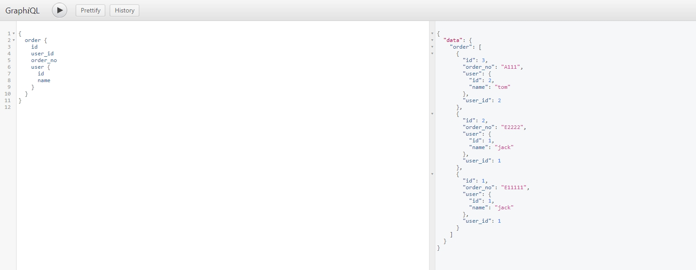

### graphql golang实战


#### 第一期：单表的使用
- 适用场景：没有嵌套关系的表查询
- 使用Demo

```go

// db.Order 定义代码
//type Order struct {
//    ID         int       `json:"id"`
//    OrderNo    string    `json:"order_no"`
//    Money      float64   `json:"money"`
//    CreateTime time.Time `json:"create_time"`
//    UserID     int       `json:"user_id"`
//}


// 第一步：构造表字段的结构，可使用 GetTableBasicFieldsByStruct 传入结构体获取
oFields, _ := gql.GetTableBasicFieldsByStruct(db.Order{})

// 也可以自己构造，如下
//oFields := make(map[string]gql.ValidType)
//oFields["id"] = gql.Int
//oFields["user_id"] = gql.Int
//oFields["order_no"] = gql.String
//oFields["money"] = gql.Float
//oFields["create_time"] = gql.DateTime

// 第二步：将表信息加入到 rootQuery
tInfo := make(map[string]*gql.TableGraphInfo)

tInfo["order"] = &gql.TableGraphInfo{
    Name:      "order",
    Fields:    oFields,
    QueryFunc: db.QueryOrderInterface, //查询表数据的函数，数据来源可以是DB，Redis，或者任意地方，业务可自定义
}
// 如果有多个表，继续添加在Map里面即可
// tInfo["table_name"] = &gql.TableGraphInfo{}

// 第三步：初始化 Gin 框架下的HandlrFunc并注册路由
// 也可以使用原始http方法 GraphHttpServeWithTableInfos
f, err := gql.GraphGinServeWithTableInfos(tInfo)
if err != nil {
    return err
}

r := gin.Default()
r.POST("/graphql", f)
r.GET("/graphql", f) //网页调试页面

r.Run(":8080") //启动后即可看到效果
```
- 访问URL：http://localhost:8080/graphql


#### 第二期：表里面有嵌套另外一个表
- 使用Demo
```go
// 背景：order表里面通过 user_id 关联User表
oFields, err := gql.GetTableBasicFieldsByStruct(db.Order{})
if err != nil {
    return fmt.Errorf("GetTableBasicFieldsByStruct err:%s", err)
}

// db.User 定义代码
//type User struct {
//  ID      int    `json:"id"`
//  Name    string `json:"name"`
//  Age     int    `json:"age"`
//  Address string `json:"address"`
//}

uFields, err := gql.GetTableBasicFieldsByStruct(db.User{})
if err != nil {
    return fmt.Errorf("GetTableBasicFieldsByStruct err:%s", err)
}

objUser := gql.NewTableObject(&gql.TableGraphInfo{
    Name:   "user",
    Fields: uFields,
})
userOfOrder := make(map[string]gql.GType)
userOfOrder["user"] = objUser

tInfo := make(map[string]*gql.TableGraphInfo)
tInfo["order"] = &gql.TableGraphInfo{
    Name:         "order",
    Fields:       oFields,
    QueryFunc:    db.QueryOrderContainUserInterface,
    CustomFields: userOfOrder,
}

f, err := gql.GraphGinServeWithTableInfos(tInfo)
if err != nil {
    return err
}
r := gin.Default()
r.POST("/graphql", f)
r.GET("/graphql", f) //网页调试页面

return r.Run(":9999")
```

```go
// QueryOrderContainUserInterface 实现

//type OrderWithUser struct {
//	*Order
//	*User
//}

func QueryOrderContainUserInterface(params map[string]interface) (interface, error) {
	// 返回 interface 是 OrderWithUser 的slice【json是 []map[string]interface 格式即可，map的key对应OrderWithUser里面的json标签】
	// 实现查询到 Order 信息后，添加每条记录里面对应 User的信息即可
}


```

- 访问URL：http://localhost:8080/graphql
  

