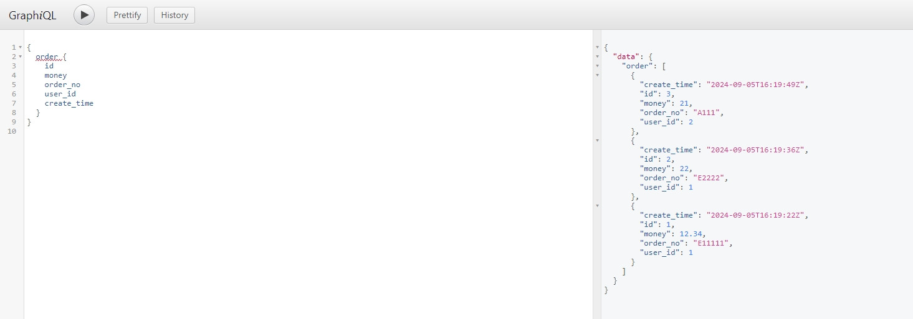

### graphql golang实战


#### 第一期：单表的使用
- 适用场景：没有嵌套关系的表查询
- 使用Demo

```go

// 第一步：构造表字段的结构，可使用 GetTableBasicFieldsByStruct 传入结构体获取
oFields, _ := gql.GetTableBasicFieldsByStruct(db.Order{})

// 也可以自己构造，如下
//oFields := make(map[string]gql.ValidType)
//oFields["id"] = gql.Int
//oFields["user_id"] = gql.Int
//oFields["order_no"] = gql.String
//oFields["money"] = gql.Float
//oFields["create_time"] = gql.DateTime

// 第二步：将表信息加入到 rootQuery
tInfo := make(map[string]*gql.TableGraphInfo)

tInfo["order"] = &gql.TableGraphInfo{
    Name:      "order",
    Fields:    oFields,
    QueryFunc: db.QueryOrderInterface, //查询表数据的函数，数据来源可以是DB，Redis，或者任意地方，业务可自定义
}
// 如果有多个表，继续添加在Map里面即可
// tInfo["table_name"] = &gql.TableGraphInfo{}

// 第三步：初始化 Gin 框架下的HandlrFunc并注册路由
// 也可以使用原始http方法 GraphHttpServeWithTableInfos
f, err := gql.GraphGinServeWithTableInfos(tInfo)
if err != nil {
    return err
}

r := gin.Default()
r.POST("/graphql", f)
r.GET("/graphql", f) //网页调试页面

r.Run(":8080") //启动后即可看到效果
```
- 访问URL：http://localhost:8080/graphql
