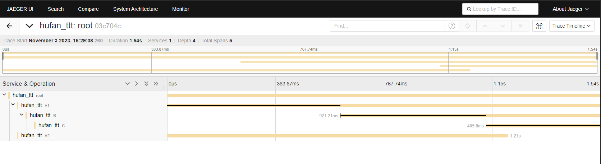
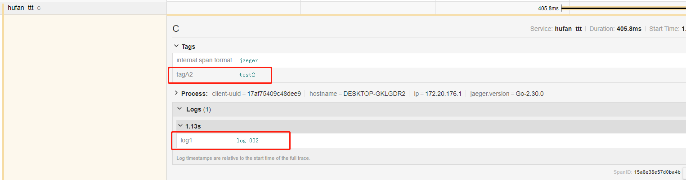

### jaeger
1. 在入口，比如 main.go 里面隐式导入 jaeger 包路径
```go 
import _ "github.com/fankane/go-utils/plugin/distributed/jaeger"
```

2. 在运行文件根目录下的 **system_plugin.yaml** 文件(没有则新建一个)里面添加如下内容
```yaml
plugins:
  distributed:  # 插件类型
    jaeger: # 插件名
      default:                # M连接名称：default，可以是其他名字
        service_name: hufan_ttt
        sampler_type: const
        sampler_param: 1
        log_span: true
        collector_endpoint: "http://localhost:14268/api/traces"
        buffer_flush_interval_ms: 100 #强制刷新时间间隔：毫秒, 不填默认 1000
        user: ""
        password: ""
```

3. 使用样例
```go
func Root() {
	ctx := GenTraceCTX(context.Background())
	span := Tracer.StartSpan(ctx, "root", Tags(map[string]interface{}{"tag1": "test1"}))
	defer SpanFinish(span)

	wg := sync.WaitGroup{}
	wg.Add(2)
	go func() {
		defer wg.Done()
		A1(CloneTraceCTX(ctx)) //并发处理时 Clone ctx
	}()
	go func() {
		defer wg.Done()
		A2(CloneTraceCTX(ctx))
	}()
	wg.Wait()
	fmt.Println("done")
}

func A1(ctx context.Context) {
	span := Tracer.StartSpan(ctx, "A1", Tags(map[string]interface{}{"tagA1": "testA1"}))
	defer SpanFinish(span)
	time.Sleep(time.Millisecond * 600)
	B(ctx)
}

func A2(ctx context.Context) {
	span := Tracer.StartSpan(ctx, "A2", Tags(map[string]interface{}{"tagA2": "test2"}))
	defer SpanFinish(span)
	time.Sleep(time.Millisecond * 1200)
}

func B(ctx context.Context) {
	span := Tracer.StartSpan(ctx, "B", Logs(map[string]string{"log1": "log 001"}))
	defer SpanFinish(span)
	time.Sleep(time.Millisecond * 500)
	C(ctx)
}

func C(ctx context.Context) {
	span := Tracer.StartSpan(ctx, "C", Logs(map[string]string{"log1": "log 002"}), Tags(map[string]interface{}{"tagA2": "test2"}))
	defer SpanFinish(span)
	time.Sleep(time.Millisecond * 400)
}
```
4. 效果展示
- 
- 
5. jaeger UI docker安装
```shell
docker run -d --name jaeger2 \
  -e COLLECTOR_ZIPKIN_HOST_PORT=:9411 \
  -p 5775:5775/udp \
  -p 6831:6831/udp \
  -p 6832:6832/udp \
  -p 5778:5778 \
  -p 16686:16686 \
  -p 14268:14268 \
  -p 14250:14250 \
  -p 9411:9411 jaegertracing/all-in-one:latest
```
- UI 访问：http://localhost:16686
- 自定义UI基础路径 
  - 可使用：-e QUERY_BASE_PATH='/custom' 
  - 此时URL：http://localhost:16686/custom

