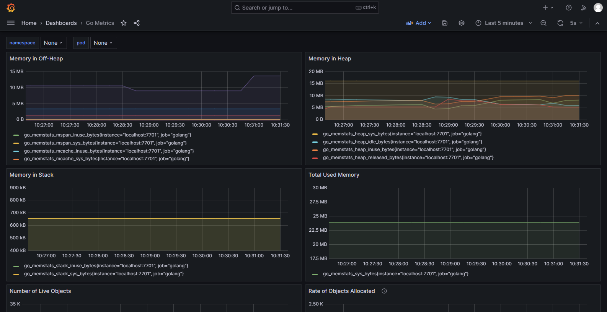
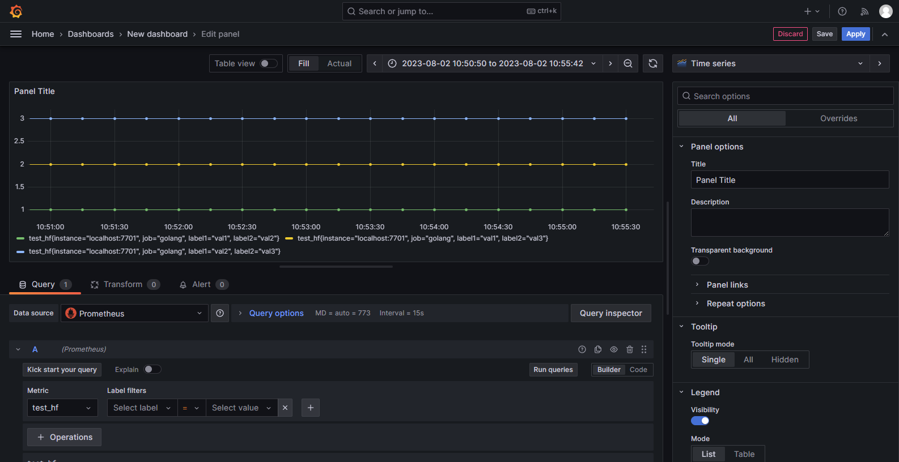

### Prometheus
1. 在入口，比如 main.go 里面隐式导入prometheus包路径
```go 
import _ "github.com/fankane/go-utils/plugin/monitor/prometheus"
```

2. 在运行文件根目录下的 **system_plugin.yaml** 文件(没有则新建一个)里面添加如下内容
```yaml
plugins:
  monitor:  # 插件类型:
    prometheus: # 插件名
      port: 7701  #Prometheus服务监听端口号，不要和服务本身端口重复
      path: "/metrics"
      custom_collects:
        - coll_type: gauge  #采集类型[counter, gauge, histogram, summary]
          info:
            test1:                  # 指标名
              help: 自定义计数指标1  # 指标说明
              labels:
                - label1          # 标签
                - label2          # 标签
```

3. 效果展示
- 3.1 什么都不使用的时候，默认采集go服务的相关数据，结合grafana面板即可看到效果
  - [Go-metrics 面板配置样例](https://grafana.com/grafana/dashboards/10826-go-metrics/)
  - 

- 3.2 自定义数据上报
```go
    g := GetGaugeVec("test1") // test1 是在配置文件里面的指标名
    for i := 0; i < 100; i++ {
	  g.WithLabelValues("val1", "val2").Set(1.0)
	  g.WithLabelValues("val1", "val3").Set(2.0)
	  g.WithLabelValues("val2", "val3").Set(3.0)
	  time.Sleep(time.Millisecond * 50)
    }
    // WithLabelValues 的 lables 参数个数需要与配置文件里面的 labels 数量匹配
```
- 

4. [prometheus & grafana 安装教程](https://juejin.cn/post/7130391327413370887)