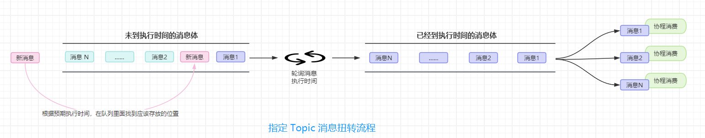

### memory
#### 介绍
memory是一个自研的基于内存的消息队列，支持按topic发送和消费数据
- 生产者可以给任意topic队列发送消息，可以多个生产者
- 一个消费者同时只能消费一个topic的数据，可以同时有多个消费者(消费不同topic即可)
- 支持配置消息最大数量，以及消息最大占用内存
- 可获取整个队列里面消息条数和占用内存大小，也可或者指定topic里面的消息条数和占用内存大小
- 如果服务重启，尚未消费的数据会丢失，处理方式
  - 1)可以获取队列里面还有多少条数据未消费，配合服务优雅升级时，处理完剩余消息
  - 2)可以服务重启前，备份队列数据到文件，启动的时候，从文件加载到内存

#### 流程图
- 

1. 在入口，比如 main.go 里面隐式导入 memory 包路径
```go 
import _ "github.com/fankane/go-utils/plugin/queue/memory"
```

2. 在运行文件根目录下的 **system_plugin.yaml** 文件(没有则新建一个)里面添加如下内容
```yaml
plugins:
  queue:  # 插件类型
    memory:
      buffer_size: 1000   #队列缓冲区，不填默认 1000，超过缓冲区大小的，到了消费的时间，入消费队列会阻塞
      max_size: 10240000  # 占用内存上限，单位B，不填默认无限制
      max_len: 3000       # 堆积消息数量上限，不填默认无限制
      load_at_begin: true         #启动时加载数据，默认false
      load_file: "./backup"       #当load_at_begin=true时必填
```

3. 在需要使用的地方，直接使用
```go
// 发送消息到队列
NewProducer().SendMessage(topic, []byte("hello"), Delay(time.Second)) //发送消息到队列，延迟1秒消费

// 消费数据
RegisterHandler(topic, func(ctx context.Context, value []byte) error {
    fmt.Println("消费数据:", string(value))
    return nil
})
```